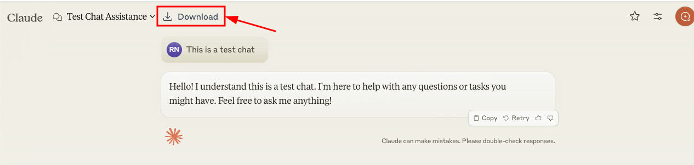
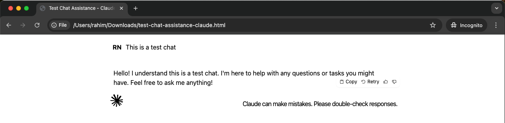

# Claude Chat Downloader

A Chrome extension that allows you to save Claude.ai chat conversations as HTML files with preserved formatting.

## Features

- Adds a download button to Claude.ai chat interface
- Preserves chat formatting using Tailwind CSS
- Generates clean filenames based on chat titles
- Downloads complete chat transcripts as standalone HTML files
- Maintains all styling and layout of the original chat

## Installation

1. Clone this repository or download the source code
2. Open Chrome and navigate to `chrome://extensions/`
3. Enable "Developer mode" in the top right
4. Click "Load unpacked" and select the directory containing the extension files

## Usage

1. Visit [Claude.ai](https://claude.ai) and open any chat
2. Look for the download button in the chat interface (shows an icon and "Download" text)
3. Click the button to save the current chat
4. Choose your save location in the browser's download dialog
5. The chat will be saved as an HTML file with the chat title as the filename

## Project Structure

- `manifest.json` - Extension configuration and permissions
- `popup.html` - Simple popup interface
- `popup.js` - Handles popup button click and initiates download
- `content.js` - Injects download button and handles chat content extraction
- `background.js` - Manages file download process
- `styles.css` - Custom styling for the download button

## Technical Details

The extension works by:
1. Injecting a download button into the Claude interface
2. Capturing the chat content when requested
3. Creating a standalone HTML file with:
   - Original chat content
   - Embedded Tailwind CSS (via CDN)
   - Preserved Tailwind classes and layout
   - Self-contained HTML document with all necessary styling
4. The HTML file includes Tailwind CSS 2.2.19 via CDN to maintain the exact same styling as the original Claude interface
5. Handling the download through Chrome's download API

## Dependencies

- Tailwind CSS (2.2.19) - Loaded via CDN in generated files

## Permissions

The extension requires:
- `downloads` - For saving files
- Host permission for `https://claude.ai/*`

## Development

To modify the extension:
1. Make your changes to the source files
2. Visit `chrome://extensions/`
3. Click the refresh icon on the extension card
4. Test your changes on Claude.ai

## Browser Compatibility

Currently only tested and supported on Google Chrome. May work on other Chromium-based browsers but this is not guaranteed.

## Contributing

Feel free to submit issues and enhancement requests!

## License

This project is licensed under the GNU General Public License v3.0 - see the [LICENSE](LICENSE) file for details.

This means you are free to:
- Use the code commercially
- Modify the code
- Distribute the code
- Place warranty

Under the following conditions:
- Source code must be made available when the extension is distributed
- A copy of the license and copyright notice must be included
- Modifications must be released under the same license
- Changes made to the code must be documented
